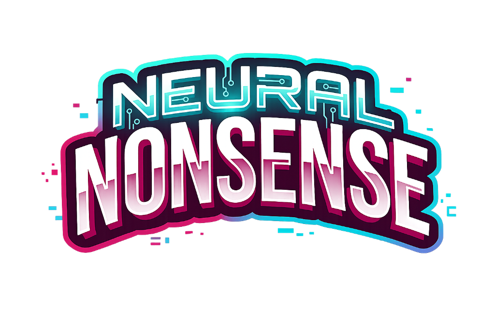

# Neural Nonsense
#### A party game where you try to be funnier than an AI and your friends

## About
Neural Nonsense is a _Quiplash_-inspired social party game where you face off against your friends to try to see who can be funnier than an AI... and everyone else.  
Created as my submission for the Congressional App Challenge 2026.  

This is the development repository for the game; if you want to play it, check out the hosted version [here](https://youtu.be/dQw4w9WgXcQ?t=0). Otherwise, keep scrolling down to see technical details.

## Licensing
Neural Nonsense's code is provided under the terms of the PolyForm Perimeter License 1.0.1. Please see [the license file](LICENSE) for information and terms.  

## Project Structure
This repository is structured into two parts: the client and server, the code for which can be found in the respectively-named directories.  

The client is written using Svelte 5, TailwindCSS, and TypeScript.  

The server is written in C# using ASP.NET with SignalR and stores all state in-memory. There is no external database.

## How to Run
First, install dependencies. You'll need Node.js, PNPM, and the .NET SDK including ASP.NET, version 10.0.0 or newer.  

Then, simply clone the repository and use the provided `setup.sh` script. Neural Nonsense is designed to run on Unix-like systems **only**. Do not expect to get it running on Windows. On first run, all necessary NPM packages will be installed via `pnpm`. The development HTTPS certificate will also be created at this point, and will ask for a root password to generate it.  

You can then start the development servers using the provided `run.sh` script, which will open the Vite dev server on port `5173`, making it available to the network, and also the ASP.NET backend server on port `6171`. Both use HTTPS, so you may need to add the generated root certificate file (`.certs/rootCA.pem`) to your system's trust store.
